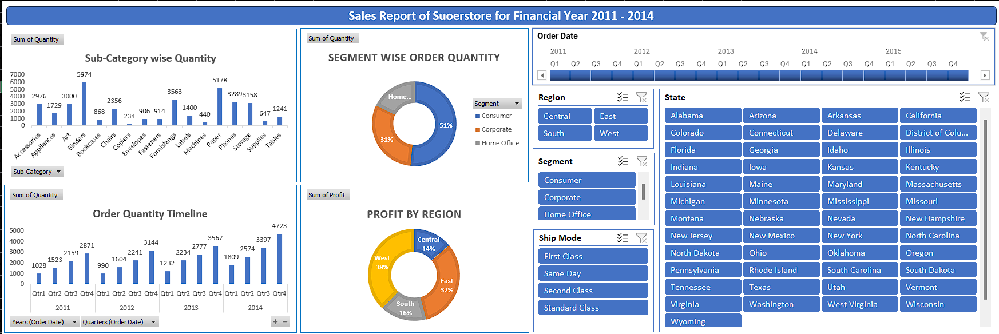

# **Kulkaran Singh**

Welcome to my portfolio! Below you'll find details about my background, skills, experience, projects, and education.

---

## 📍 **Location**
**Dartmouth, NS, Canada**

---

## 📧 **Contact Information**
- **Email**: [Kulkaransingh99@gmail.com](mailto:Kulkaransingh99@gmail.com)
- **Phone**: +1 (825) 925-1712
- **GitHub**: [GitHub Profile](https://github.com/Kulkaran09)
- **LinkedIn**: [LinkedIn Profile](www.linkedin.com/in/kulkaran-singh-a32206259)

---

## 🛠️ **Skills**

I have a broad set of technical and analytical skills that allow me to work efficiently in various environments and tackle complex problems:

- **Programming Languages**: Python, C/C++
- **Data Science & Machine Learning**: SQL, Machine Learning, Data Analysis, TensorFlow, Computer Vision
- **Web Development**: React.js
- **Business & Communication**: Power BI, MS Office, Business Communication, Problem Solving

---

## 💼 **Experience**

### **Data Analyst Intern** – *Academic Project*  
**Saskatchewan Polytechnic College** | *December 2023*  
- Developed interactive dashboards and visualizations using **Power BI** and **Python** to provide data insights.
- Conducted **data preprocessing** and **feature engineering** for predictive models.
- Analyzed real-world datasets to extract actionable insights for project stakeholders.

### **AI & Data Analytics Student Project** – *Saskatchewan Polytechnic College*  
**April 2024**  
- Built and trained **machine learning models** for various classification tasks to enhance predictive accuracy.
- Managed **SQL databases** to extract, clean, and analyze structured data for meaningful results.
- Designed and deployed an AI-based **garbage classification model**, contributing to sustainable waste management practices.

---

## 📈 **Projects**

### **Garbage Classification using AI**  
**Technologies**: Python, TensorFlow, Computer Vision  
Developed a machine learning model capable of classifying different types of garbage, streamlining waste management and supporting sustainability efforts.

### **Sales and Customer Data Dashboard**  
**Technologies**: Power BI, SQL, Data Visualization  
Created a dynamic **Power BI** dashboard to visualize and analyze sales trends and customer behavior. This tool helps in identifying key business opportunities and improving decision-making.

---

## 🎓 **Education**

### **Post Graduate Certificate in Programming for AI**  
**Nova Scotia Community College**  
*September 2024 – Present*

### **Post Graduate Certificate in AI & Data Analytics**  
**Saskatchewan Polytechnic College**  
*September 2023 – April 2024*

### **Bachelor of Science in Computer Science**  
**Punjabi University, India**  
*September 2019 – May 2022*

---

## 🌱 **Let's Connect!**

Feel free to reach out via email or LinkedIn for any inquiries. You can also explore my projects and code on my **[GitHub profile](https://github.com/Kulkaran09)**.

Thank you for visiting my portfolio!

---
